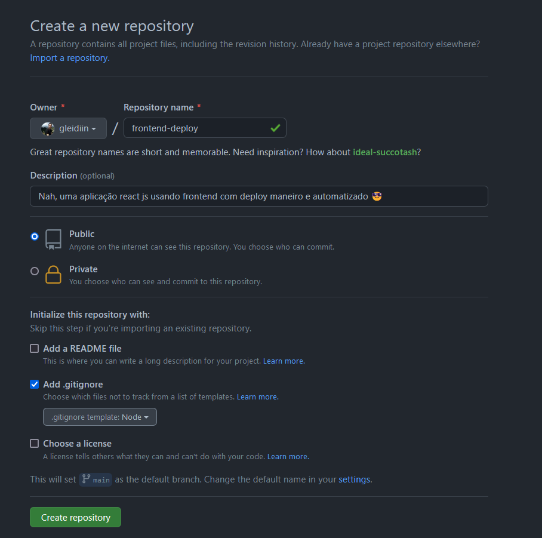
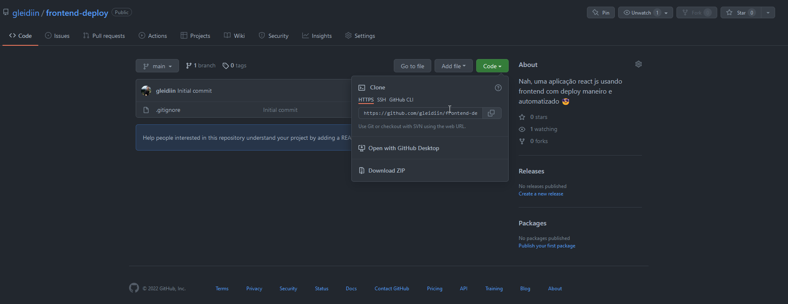
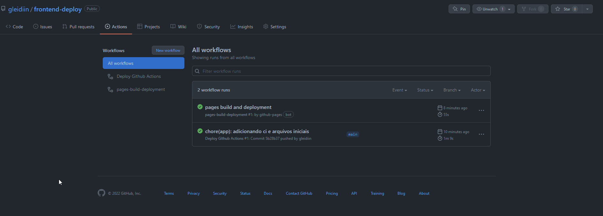
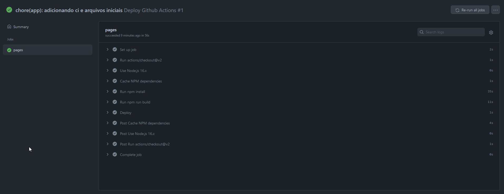
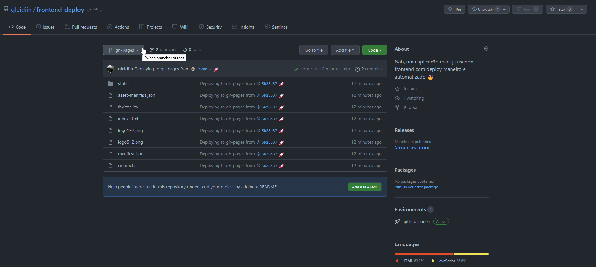
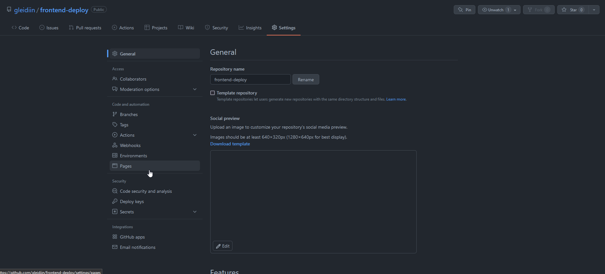
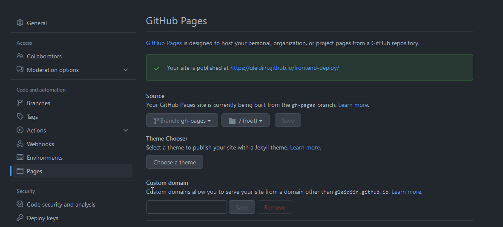

Esse artigo tem como objetivo esclarecer o funcionamento de aplicações frontend no estilo estático, fazer deployment dessas aplicações em ambiente cloud e também mostrar conceitos e funcionamento de provedores.

---

- Assuntos para serem abordados:
    - O que é uma aplicação frontend estática;
    - O que são os artefatos ou arquivos de compilação;
    - Subindo aplicações estáticas no Github Pages
    - Como configurar um ambiente de SPA utilizando AWS;
    - Como melhorar a velocidade de entrega da sua aplicação usando amazon CloudFront

---

## Aplicação Frontend + Github Pages

Criar aplicações frontend é quase uma mania, ainda mais quando vemos um projeto interessante ou algo legal que gostaríamos de tentar replicar. Porém automatizar um deploy ou subir isso para algumas pessoas verem pode se tornar um pouco frustrate quando não temos conhecimento em como fazer e quais são as melhores maneiras de se fazer isso. 

Então veremos algumas formas de fazer deploy (famoso deployar) aplicações frontend usando ferramentas de mercado e padrões já conhecidos. 

Antes de mais nada, gostaria de deixar claro que as formas que iremos ver são relacionadas ao frontend estático, que é conhecido como SPA (single page application- aplicação de página única). esse tipo de aplicação tem como objetivo criar uma série de arquivos estáticos que serão utilizados no servidor para renderizar as páginas, caso você esteja trabalhando com SSR (server side rendering - renderização no servidor) isso se torna um pouco mais complicado, uma vez que você precisará de um servidor que irá renderizar o conteúdo e devolver para o usuário. 

Como saber se estou trabalhando com SSR ou SPA? Verifique se o build no `package.json` irá gerar uma pasta com os arquivos estáticos ou até mesmo terá instruções de como utilizar sua aplicação de tal forma.

## Como configurar o repositório do Github

Chega de papo! Vamos começar com o clássico e o único pré-requisito para esse primeiro tutorial é: ter conhecimento de Git e Github (só isso?). Iremos disponibilizar uma página inteira no Github utilizando o Github Pages. 😊

Primeiro, teremos que [criar um novo repositório público](https://github.com/new) no Github, lembrando que é publico porque o Github Pages tem uma limitação para criação de páginas para repositórios não públicos, caso queria você pode assinar o premium e criar com um repositório privado!



Siga o link acima e preencha os campos que estão demarcados com o *

Após criado, use o comando git para clonar o repositório e adicionar os arquivos da sua aplicação, na parte de cima do github, temos uma opção chamada *code* e ao clicar nela abrirá um *dropdown menu* copie o conteúdo dentro do campo de http e prossiga para a próxima etapa.



<aside>
💡 Considerando que a sua primeira vez utilizando o Github, faça download do CLI do Github para seu sistema operacional e logo após o download, instale o executável o comando `git` irá aparecer no seu terminal. Após utilizar o comando `git clone` será necessário efetuar login para ter acessos no repositório

</aside>

Pronto, com tudo copiado, agora basta ir no seu terminal preferido e rodar:

```bash
git clone <link do repositorio> 
```

Agora é o momento que iremos adicionar os nosso arquivos fontes dentro do nosso repositório, é important lembrar que o repositório é público então outras pessoas terão acesso a isto, tome cuidado com dados sensíveis!

## Como publicar no Github Pages

Existem duas formas de fazer isso, você gerar uma branch com o nome `gh-pages`  e subir os arquivos de build manualmente, ou utilizar um step do Github actions que vai criar automaticamente essa branch e manter os arquivos de build atualizados. Claro que vamos utilizar o Github Actions, pois torna o processo mais fácil e sem muita correria.

Na raiz do seu repositório, crie uma pasta chamada `.github` e dentro desta pasta crie outra com o nome `workflows` na pasta workflows vamos adicionar arquivos que irão realizar comandos que para acionar o Github Actions, basicamente o que vamos fazer é no momento em que sua branch `main` estiver recebendo novas atualizações, iremos subir uma nova atualização para o Github Pages.

Dentro da pasta workflows adicione um arquivo chamado `github-pages.yml` e cole o conteúdo a seguir (atenção, leia os comentários para entender mais o que está sendo executado)

```yaml
name: Deploy Github Actions

on:
  push: # ação que ira acionar o github actions
    branches:
      - main  # branch que será excutado o Github actions

jobs:
  pages:
    runs-on: ubuntu-latest # versão do sistema operacional
    steps: # sequênciade passos que serão executados
      - uses: actions/checkout@v2 # baixar arquivos do repositório
      - name: Use Node.js 16.x  # configurar executáveis npm
        uses: actions/setup-node@v2
        with:
          node-version: '16'
      - name: Cache NPM dependencies # baixando/subindo um cache para adiantar o processo
        uses: actions/cache@v2
        with:
          path: node_modules
          key: ${{ runner.OS }}-npm-cache
          restore-keys: |
            ${{ runner.OS }}-npm-cache
      - run: npm install # instalando dependencias
      - run: npm run build # construindo a aplicação
      - name: Deploy # criando uma branch ou atualizando a branch gh-pages
        uses: JamesIves/github-pages-deploy-action@v4.2.5
        with:
          branch: gh-pages 
          folder: ./build # pasta com os assets e estaticos
```

Depois de acionado, suba essa atualização para o seu repositório do Gihtub (sua branch main) e vá para a tab actions, provavelmente verá essa mesma visualização que temos abaixo — se o seu processo de build for um pouco mais lento, em vez de estar verde, vai estar amarelo o que mostra que o processo ainda está rodando.



E se clicar no processo, você terá acesso a uma visualização igual a visualização a seguir:



Aqui é possível acompanhar passo-a-passo sendo executado e, caso queira modificar algo, basta mudar os comandos ou a sequência que você adicionou anteriormente.

Após o processo terminar de rodar, ao ir na tab branches será possível ver que temos uma nova branch chamada gh-pages, e o contéudo dela é os arquivos de build da sua aplicação



Com isso, ainda teremos um passo a mais para terminamos a configuração, será necessário configurar o Github para distruibir a página do seu projeto, para isso vá em: `Settings` 



Depois selecione a tab pages, e dentro de sua configuração, aponte a branch que irá para o github actions a mesma que você gerou gh-pages, e clique em salvar.



<aside>
💡 Caso esteja utilizando react ou outro framework, será necessário mudar as referênciasde script para o path correto, isso significa que em vez de procurar as dependências dentro da raiz do site, será necessário buscar no caminho relativo ao nome do repositório. No meu caso era /frontend-deploy alguns frameworks já vem com facilitadores para tal alteração.

</aside>

Caso tenha interesse no repositório ou no resultado, ambos seguem abaixo! 

**Site Github Pages:** [https://gleidiin.github.io/frontend-deploy/](https://gleidiin.github.io/frontend-deploy/)

**Repositório Github:** https://github.com/gleidiin/frontend-deploy

## **Próximos passos...**

A seguir em nosso próximo tutorial, vamos conversar sobre como fazer deploys automatizados na AWS, destacando cenários que estamos trabalhando com aplicações SPA!